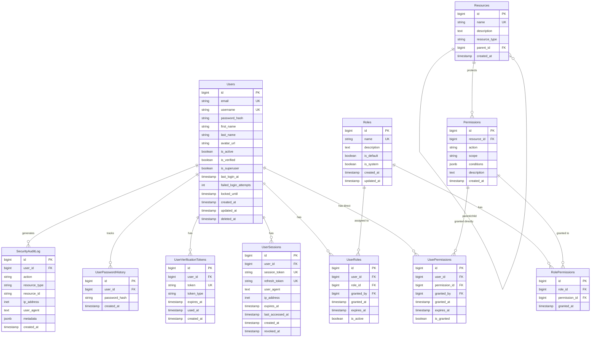
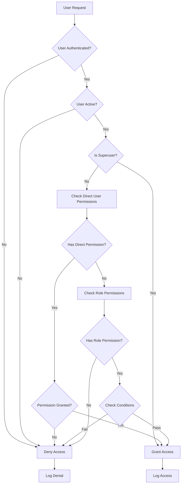
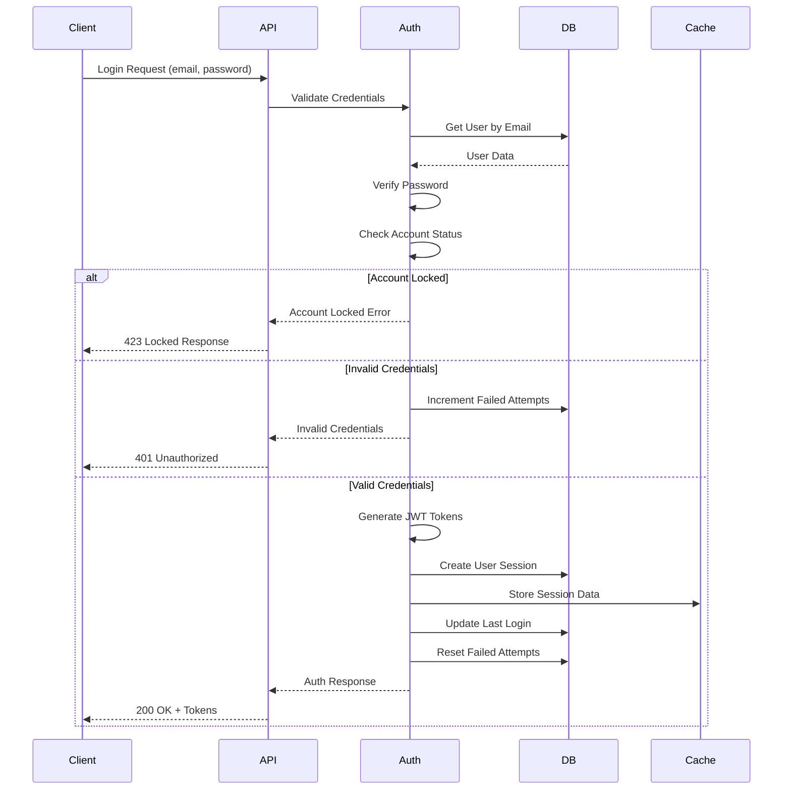
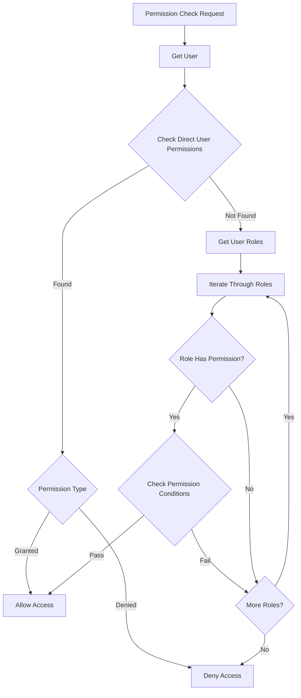

# User Authentication & RBAC Authorization Data Model

## Entity Relationship Diagram



## Permission Check Flow



## Authentication Flow



## RBAC Permission Resolution



## Database Schema (PostgreSQL)

### Core Authentication Tables

```sql
-- Users table - Core user entity
CREATE TABLE users (
    id BIGSERIAL PRIMARY KEY,
    email VARCHAR(255) UNIQUE NOT NULL,
    username VARCHAR(50) UNIQUE,
    password_hash VARCHAR(255) NOT NULL,
    first_name VARCHAR(100),
    last_name VARCHAR(100),
    avatar_url VARCHAR(500),
    is_active BOOLEAN DEFAULT true,
    is_verified BOOLEAN DEFAULT false,
    is_superuser BOOLEAN DEFAULT false,
    last_login_at TIMESTAMP WITH TIME ZONE,
    failed_login_attempts INTEGER DEFAULT 0,
    locked_until TIMESTAMP WITH TIME ZONE,
    created_at TIMESTAMP WITH TIME ZONE DEFAULT CURRENT_TIMESTAMP,
    updated_at TIMESTAMP WITH TIME ZONE DEFAULT CURRENT_TIMESTAMP,
    deleted_at TIMESTAMP WITH TIME ZONE,

    CONSTRAINT email_format CHECK (email ~* '^[A-Za-z0-9._%+-]+@[A-Za-z0-9.-]+\.[A-Za-z]{2,}$'),
    CONSTRAINT username_format CHECK (username ~* '^[a-zA-Z0-9_-]{3,50}$')
);

-- User verification tokens
CREATE TABLE user_verification_tokens (
    id BIGSERIAL PRIMARY KEY,
    user_id BIGINT NOT NULL REFERENCES users(id) ON DELETE CASCADE,
    token VARCHAR(255) NOT NULL UNIQUE,
    token_type VARCHAR(50) NOT NULL, -- 'email_verification', 'password_reset', 'email_change'
    expires_at TIMESTAMP WITH TIME ZONE NOT NULL,
    used_at TIMESTAMP WITH TIME ZONE,
    created_at TIMESTAMP WITH TIME ZONE DEFAULT CURRENT_TIMESTAMP,

    CONSTRAINT valid_token_type CHECK (token_type IN ('email_verification', 'password_reset', 'email_change'))
);

-- User sessions for tracking active sessions
CREATE TABLE user_sessions (
    id BIGSERIAL PRIMARY KEY,
    user_id BIGINT NOT NULL REFERENCES users(id) ON DELETE CASCADE,
    session_token VARCHAR(255) NOT NULL UNIQUE,
    refresh_token VARCHAR(255) UNIQUE,
    user_agent TEXT,
    ip_address INET,
    expires_at TIMESTAMP WITH TIME ZONE NOT NULL,
    last_accessed_at TIMESTAMP WITH TIME ZONE DEFAULT CURRENT_TIMESTAMP,
    created_at TIMESTAMP WITH TIME ZONE DEFAULT CURRENT_TIMESTAMP,
    revoked_at TIMESTAMP WITH TIME ZONE
);
```

### RBAC Core Tables

```sql
-- Roles table
CREATE TABLE roles (
    id BIGSERIAL PRIMARY KEY,
    name VARCHAR(100) UNIQUE NOT NULL,
    description TEXT,
    is_default BOOLEAN DEFAULT false,
    is_system BOOLEAN DEFAULT false, -- System roles cannot be deleted
    created_at TIMESTAMP WITH TIME ZONE DEFAULT CURRENT_TIMESTAMP,
    updated_at TIMESTAMP WITH TIME ZONE DEFAULT CURRENT_TIMESTAMP,

    CONSTRAINT role_name_format CHECK (name ~* '^[a-zA-Z0-9_-]+$')
);

-- Resources that can be protected
CREATE TABLE resources (
    id BIGSERIAL PRIMARY KEY,
    name VARCHAR(100) UNIQUE NOT NULL, -- e.g., 'users', 'orders', 'reports'
    description TEXT,
    resource_type VARCHAR(50) NOT NULL DEFAULT 'entity', -- 'entity', 'endpoint', 'feature'
    parent_id BIGINT REFERENCES resources(id),
    created_at TIMESTAMP WITH TIME ZONE DEFAULT CURRENT_TIMESTAMP,

    CONSTRAINT resource_type_check CHECK (resource_type IN ('entity', 'endpoint', 'feature'))
);

-- Permissions define what actions can be performed
CREATE TABLE permissions (
    id BIGSERIAL PRIMARY KEY,
    resource_id BIGINT NOT NULL REFERENCES resources(id) ON DELETE CASCADE,
    action VARCHAR(50) NOT NULL, -- 'create', 'read', 'update', 'delete', 'manage'
    scope VARCHAR(50) DEFAULT 'all', -- 'all', 'own', 'team', 'department'
    conditions JSONB, -- Additional conditions for permission
    description TEXT,
    created_at TIMESTAMP WITH TIME ZONE DEFAULT CURRENT_TIMESTAMP,

    UNIQUE(resource_id, action, scope),
    CONSTRAINT action_check CHECK (action IN ('create', 'read', 'update', 'delete', 'manage', 'execute')),
    CONSTRAINT scope_check CHECK (scope IN ('all', 'own', 'team', 'department', 'organization'))
);
```

### Relationship Tables

```sql
-- Many-to-many: Users and Roles
CREATE TABLE user_roles (
    id BIGSERIAL PRIMARY KEY,
    user_id BIGINT NOT NULL REFERENCES users(id) ON DELETE CASCADE,
    role_id BIGINT NOT NULL REFERENCES roles(id) ON DELETE CASCADE,
    granted_by BIGINT REFERENCES users(id),
    granted_at TIMESTAMP WITH TIME ZONE DEFAULT CURRENT_TIMESTAMP,
    expires_at TIMESTAMP WITH TIME ZONE,
    is_active BOOLEAN DEFAULT true,

    UNIQUE(user_id, role_id)
);

-- Many-to-many: Roles and Permissions
CREATE TABLE role_permissions (
    id BIGSERIAL PRIMARY KEY,
    role_id BIGINT NOT NULL REFERENCES roles(id) ON DELETE CASCADE,
    permission_id BIGINT NOT NULL REFERENCES permissions(id) ON DELETE CASCADE,
    granted_at TIMESTAMP WITH TIME ZONE DEFAULT CURRENT_TIMESTAMP,

    UNIQUE(role_id, permission_id)
);

-- Direct user permissions (overrides role permissions)
CREATE TABLE user_permissions (
    id BIGSERIAL PRIMARY KEY,
    user_id BIGINT NOT NULL REFERENCES users(id) ON DELETE CASCADE,
    permission_id BIGINT NOT NULL REFERENCES permissions(id) ON DELETE CASCADE,
    granted_by BIGINT REFERENCES users(id),
    granted_at TIMESTAMP WITH TIME ZONE DEFAULT CURRENT_TIMESTAMP,
    expires_at TIMESTAMP WITH TIME ZONE,
    is_granted BOOLEAN DEFAULT true, -- false means explicitly denied

    UNIQUE(user_id, permission_id)
);
```

### Audit and Security Tables

```sql
-- Security audit log
CREATE TABLE security_audit_log (
    id BIGSERIAL PRIMARY KEY,
    user_id BIGINT REFERENCES users(id),
    action VARCHAR(100) NOT NULL,
    resource_type VARCHAR(100),
    resource_id VARCHAR(100),
    ip_address INET,
    user_agent TEXT,
    metadata JSONB,
    created_at TIMESTAMP WITH TIME ZONE DEFAULT CURRENT_TIMESTAMP
);

-- Password history for preventing reuse
CREATE TABLE user_password_history (
    id BIGSERIAL PRIMARY KEY,
    user_id BIGINT NOT NULL REFERENCES users(id) ON DELETE CASCADE,
    password_hash VARCHAR(255) NOT NULL,
    created_at TIMESTAMP WITH TIME ZONE DEFAULT CURRENT_TIMESTAMP
);

-- Indexes for Performance
CREATE INDEX idx_users_email ON users(email);
CREATE INDEX idx_users_username ON users(username);
CREATE INDEX idx_users_is_active ON users(is_active);
CREATE INDEX idx_user_sessions_user_id ON user_sessions(user_id);
CREATE INDEX idx_user_sessions_token ON user_sessions(session_token);
CREATE INDEX idx_user_roles_user_id ON user_roles(user_id);
CREATE INDEX idx_role_permissions_role_id ON role_permissions(role_id);
CREATE INDEX idx_security_audit_user_id ON security_audit_log(user_id);
CREATE INDEX idx_security_audit_created_at ON security_audit_log(created_at);
```

## SQLAlchemy Models (Python Backend)

### User Authentication Models

```python
# models/user.py
from sqlalchemy import Column, BigInteger, String, Boolean, DateTime, Integer, Text, JSON
from sqlalchemy.sql import func
from sqlalchemy.orm import relationship
from werkzeug.security import generate_password_hash, check_password_hash
from app.models.base import Base

class User(Base):
    __tablename__ = "users"

    id = Column(BigInteger, primary_key=True, index=True)
    email = Column(String(255), unique=True, index=True, nullable=False)
    username = Column(String(50), unique=True, index=True)
    password_hash = Column(String(255), nullable=False)
    first_name = Column(String(100))
    last_name = Column(String(100))
    avatar_url = Column(String(500))
    is_active = Column(Boolean, default=True)
    is_verified = Column(Boolean, default=False)
    is_superuser = Column(Boolean, default=False)
    last_login_at = Column(DateTime(timezone=True))
    failed_login_attempts = Column(Integer, default=0)
    locked_until = Column(DateTime(timezone=True))
    created_at = Column(DateTime(timezone=True), server_default=func.now())
    updated_at = Column(DateTime(timezone=True), server_default=func.now(), onupdate=func.now())
    deleted_at = Column(DateTime(timezone=True))

    # Relationships
    user_roles = relationship("UserRole", back_populates="user")
    user_permissions = relationship("UserPermission", back_populates="user")
    sessions = relationship("UserSession", back_populates="user")
    verification_tokens = relationship("UserVerificationToken", back_populates="user")

    @property
    def full_name(self) -> str:
        return f"{self.first_name} {self.last_name}".strip()

    def set_password(self, password: str) -> None:
        self.password_hash = generate_password_hash(password)

    def check_password(self, password: str) -> bool:
        return check_password_hash(self.password_hash, password)

    def is_locked(self) -> bool:
        if self.locked_until is None:
            return False
        return self.locked_until > func.now()

    def get_roles(self) -> list[str]:
        return [ur.role.name for ur in self.user_roles if ur.is_active]

    def has_permission(self, resource: str, action: str, scope: str = "all") -> bool:
        # Check direct user permissions first
        for up in self.user_permissions:
            perm = up.permission
            if (perm.resource.name == resource and
                perm.action == action and
                perm.scope == scope):
                return up.is_granted

        # Check role permissions
        for ur in self.user_roles:
            if not ur.is_active:
                continue
            for rp in ur.role.role_permissions:
                perm = rp.permission
                if (perm.resource.name == resource and
                    perm.action == action and
                    perm.scope == scope):
                    return True

        return False

class UserSession(Base):
    __tablename__ = "user_sessions"

    id = Column(BigInteger, primary_key=True)
    user_id = Column(BigInteger, ForeignKey("users.id"), nullable=False)
    session_token = Column(String(255), unique=True, nullable=False)
    refresh_token = Column(String(255), unique=True)
    user_agent = Column(Text)
    ip_address = Column(String(45))  # IPv6 compatible
    expires_at = Column(DateTime(timezone=True), nullable=False)
    last_accessed_at = Column(DateTime(timezone=True), server_default=func.now())
    created_at = Column(DateTime(timezone=True), server_default=func.now())
    revoked_at = Column(DateTime(timezone=True))

    # Relationships
    user = relationship("User", back_populates="sessions")

    def is_valid(self) -> bool:
        return (self.revoked_at is None and
                self.expires_at > func.now())
```

### RBAC Models

```python
# models/rbac.py
from sqlalchemy import Column, BigInteger, String, Boolean, DateTime, Text, JSON, ForeignKey
from sqlalchemy.sql import func
from sqlalchemy.orm import relationship
from app.models.base import Base

class Role(Base):
    __tablename__ = "roles"

    id = Column(BigInteger, primary_key=True)
    name = Column(String(100), unique=True, nullable=False)
    description = Column(Text)
    is_default = Column(Boolean, default=False)
    is_system = Column(Boolean, default=False)
    created_at = Column(DateTime(timezone=True), server_default=func.now())
    updated_at = Column(DateTime(timezone=True), server_default=func.now(), onupdate=func.now())

    # Relationships
    user_roles = relationship("UserRole", back_populates="role")
    role_permissions = relationship("RolePermission", back_populates="role")

class Resource(Base):
    __tablename__ = "resources"

    id = Column(BigInteger, primary_key=True)
    name = Column(String(100), unique=True, nullable=False)
    description = Column(Text)
    resource_type = Column(String(50), nullable=False, default="entity")
    parent_id = Column(BigInteger, ForeignKey("resources.id"))
    created_at = Column(DateTime(timezone=True), server_default=func.now())

    # Relationships
    permissions = relationship("Permission", back_populates="resource")
    parent = relationship("Resource", remote_side=[id])

class Permission(Base):
    __tablename__ = "permissions"

    id = Column(BigInteger, primary_key=True)
    resource_id = Column(BigInteger, ForeignKey("resources.id"), nullable=False)
    action = Column(String(50), nullable=False)
    scope = Column(String(50), default="all")
    conditions = Column(JSON)
    description = Column(Text)
    created_at = Column(DateTime(timezone=True), server_default=func.now())

    # Relationships
    resource = relationship("Resource", back_populates="permissions")
    role_permissions = relationship("RolePermission", back_populates="permission")
    user_permissions = relationship("UserPermission", back_populates="permission")

class UserRole(Base):
    __tablename__ = "user_roles"

    id = Column(BigInteger, primary_key=True)
    user_id = Column(BigInteger, ForeignKey("users.id"), nullable=False)
    role_id = Column(BigInteger, ForeignKey("roles.id"), nullable=False)
    granted_by = Column(BigInteger, ForeignKey("users.id"))
    granted_at = Column(DateTime(timezone=True), server_default=func.now())
    expires_at = Column(DateTime(timezone=True))
    is_active = Column(Boolean, default=True)

    # Relationships
    user = relationship("User", back_populates="user_roles", foreign_keys=[user_id])
    role = relationship("Role", back_populates="user_roles")
    granted_by_user = relationship("User", foreign_keys=[granted_by])

class RolePermission(Base):
    __tablename__ = "role_permissions"

    id = Column(BigInteger, primary_key=True)
    role_id = Column(BigInteger, ForeignKey("roles.id"), nullable=False)
    permission_id = Column(BigInteger, ForeignKey("permissions.id"), nullable=False)
    granted_at = Column(DateTime(timezone=True), server_default=func.now())

    # Relationships
    role = relationship("Role", back_populates="role_permissions")
    permission = relationship("Permission", back_populates="role_permissions")

class UserPermission(Base):
    __tablename__ = "user_permissions"

    id = Column(BigInteger, primary_key=True)
    user_id = Column(BigInteger, ForeignKey("users.id"), nullable=False)
    permission_id = Column(BigInteger, ForeignKey("permissions.id"), nullable=False)
    granted_by = Column(BigInteger, ForeignKey("users.id"))
    granted_at = Column(DateTime(timezone=True), server_default=func.now())
    expires_at = Column(DateTime(timezone=True))
    is_granted = Column(Boolean, default=True)

    # Relationships
    user = relationship("User", back_populates="user_permissions", foreign_keys=[user_id])
    permission = relationship("Permission", back_populates="user_permissions")
    granted_by_user = relationship("User", foreign_keys=[granted_by])
```

## TypeScript Types (Frontend)

```typescript
// types/auth.ts
export interface User {
  id: number;
  email: string;
  username?: string;
  firstName?: string;
  lastName?: string;
  fullName?: string;
  avatarUrl?: string;
  isActive: boolean;
  isVerified: boolean;
  isSuperuser: boolean;
  lastLoginAt?: string;
  createdAt: string;
  updatedAt: string;
  roles: string[];
  permissions: UserPermission[];
}

export interface LoginCredentials {
  email: string;
  password: string;
  rememberMe?: boolean;
}

export interface RegisterData {
  email: string;
  username?: string;
  password: string;
  firstName?: string;
  lastName?: string;
}

export interface AuthResponse {
  user: User;
  accessToken: string;
  refreshToken: string;
  tokenType: string;
  expiresIn: number;
}

// types/rbac.ts
export interface Role {
  id: number;
  name: string;
  description?: string;
  isDefault: boolean;
  isSystem: boolean;
  permissions: Permission[];
  createdAt: string;
  updatedAt: string;
}

export interface Permission {
  id: number;
  resource: Resource;
  action: PermissionAction;
  scope: PermissionScope;
  conditions?: Record<string, any>;
  description?: string;
}

export interface Resource {
  id: number;
  name: string;
  description?: string;
  resourceType: ResourceType;
  parentId?: number;
  children?: Resource[];
}

export interface UserPermission {
  permission: Permission;
  isGranted: boolean;
  grantedAt: string;
  expiresAt?: string;
  source: "direct" | "role";
  roleName?: string;
}

export type PermissionAction =
  | "create"
  | "read"
  | "update"
  | "delete"
  | "manage"
  | "execute";
export type PermissionScope =
  | "all"
  | "own"
  | "team"
  | "department"
  | "organization";
export type ResourceType = "entity" | "endpoint" | "feature";
```

## Permission Service Implementation

```python
# services/permission_service.py
from typing import List, Optional, Dict, Any
from sqlalchemy.orm import Session
from app.models.user import User
from app.models.rbac import Permission, Resource

class PermissionService:
    def __init__(self, db: Session):
        self.db = db

    def check_permission(
        self,
        user: User,
        resource: str,
        action: str,
        scope: str = "all",
        context: Optional[Dict[str, Any]] = None
    ) -> bool:
        """Check if user has permission following the flow diagram"""

        # Superuser has all permissions
        if user.is_superuser:
            return True

        # Check if user is active
        if not user.is_active:
            return False

        # Get permission from database
        permission = self._get_permission(resource, action, scope)
        if not permission:
            return False

        # Check direct user permissions first (can override role permissions)
        user_perm = self._get_user_permission(user.id, permission.id)
        if user_perm:
            return user_perm.is_granted

        # Check role permissions
        return self._check_role_permissions(user, permission, context)

    def get_user_permissions(self, user: User) -> List[Dict[str, Any]]:
        """Get all effective permissions for a user"""
        permissions = []

        # Add role-based permissions
        for user_role in user.user_roles:
            if not user_role.is_active:
                continue

            for role_perm in user_role.role.role_permissions:
                permissions.append({
                    'permission': role_perm.permission,
                    'source': 'role',
                    'role_name': user_role.role.name,
                    'is_granted': True
                })

        # Add direct user permissions (can override role permissions)
        for user_perm in user.user_permissions:
            permissions.append({
                'permission': user_perm.permission,
                'source': 'direct',
                'is_granted': user_perm.is_granted,
                'expires_at': user_perm.expires_at
            })

        return permissions
```

## Frontend Permission Hook

```typescript
// composables/usePermissions.ts
import { computed } from "vue";
import { useAuthStore } from "@/stores/auth";

export function usePermissions() {
  const authStore = useAuthStore();

  const hasPermission = (
    resource: string,
    action: PermissionAction,
    scope: PermissionScope = "all"
  ): boolean => {
    if (!authStore.user) return false;

    // Superuser has all permissions
    if (authStore.user.isSuperuser) return true;

    // Check user permissions following the resolution diagram
    return authStore.user.permissions.some((userPerm) => {
      const perm = userPerm.permission;
      return (
        perm.resource.name === resource &&
        perm.action === action &&
        perm.scope === scope &&
        userPerm.isGranted &&
        (!userPerm.expiresAt || new Date(userPerm.expiresAt) > new Date())
      );
    });
  };

  const hasRole = (roleName: string): boolean => {
    return authStore.user?.roles.includes(roleName) || false;
  };

  const canManage = (resource: string): boolean => {
    return hasPermission(resource, "manage", "all");
  };

  const canRead = (
    resource: string,
    scope: PermissionScope = "all"
  ): boolean => {
    return hasPermission(resource, "read", scope);
  };

  const canCreate = (resource: string): boolean => {
    return hasPermission(resource, "create", "all");
  };

  const canUpdate = (
    resource: string,
    scope: PermissionScope = "all"
  ): boolean => {
    return hasPermission(resource, "update", scope);
  };

  const canDelete = (
    resource: string,
    scope: PermissionScope = "all"
  ): boolean => {
    return hasPermission(resource, "delete", scope);
  };

  return {
    hasPermission,
    hasRole,
    canManage,
    canRead,
    canCreate,
    canUpdate,
    canDelete,
  };
}
```

This comprehensive data model provides a robust foundation for authentication and RBAC authorization, with clear visual representations of relationships and processes through Mermaid diagrams.
